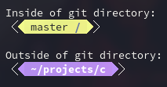
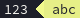

# subline

Subline is a little program that makes it relatively easy to build a prompt string.

The following subline script:
```bash
" \ue0b3"

if in-git-repo {
    cap("\ue0b2", bg=yellow, text=black)
} else {
    cap("\ue0b2", bg=blue, text=white)
}

if in-git-repo [bg(yellow) text(black)] {
    _ git-branch _ bold git-dir _
} else [bg(blue) text(white)] {
    _ bold dir _
}

bg(default)
if in-git-repo [text(yellow)] { "\ue0b0" }
else [text(blue)] { "\ue0b0" }

"\ue0b1"
```

Generates prompt strings that look like this:




## Building

Just run `bash build.sh`.

## Using

Currently, only subline only reads from standard input, so something like this should work:

```bash
./subline </path/to/my/subline/script.subline
```

Or even:
```bash
echo "bg(red) text(white) dir" | ./subline
```

## The scripting language

Subline's scripting language is rather simple. It only supports a few constructs:

### String literals
```
"blah blah"
```

These are just normal strings. They must be wrapped in double-quotes. They will be printed out when encountered. They are allowed to span multiple lines.

It is possible to use escapes to print special characters:

 * `\n` - newline
 * `\t` - tab character
 * `\"` - double-quote
 * `\uxxxx` - short unicode literal
 * `\Uxxxxxxxx` - long unicode literal
 * ...

### Hex color literals
```
#123
#123456
```

Simple hex color literals. They start with a # and contain either 3 or 6 hex characters afterwards.

3 character literals expand into 6 character literals by duplicating the character.

As one might expect, they map to RGB colors, with the first bit of the literal mapping to the red channel, the middle bit mapping to the green, and the last bit mapping to the blue, like so:

```
#rgb
#rrggbb
```

### Terminal colors
```
default

black, white
red, green, yellow, blue, magenta, cyan

bright-black, bright-white
bright-red, bright-green, bright-yellow, bright-blue, bright-magenta, bright-cyan
```

The above is an exhaustive list of supported terminal colors. The only surprise here might be the `default`, which just restores the default terminal color, depending on the context.

### Number literals
```
1
1.5
.3
2.
```

Not much surprising here. No special notations are supported at the moment.

### Environment variables
```
$SOME_VARIABLE
```

A special bit of syntax to make it easy to get the value of an environment variable. Starts with a $, ends at the first whitespace character after that.

### Function calls
```
cap("\ue0b2", bg=yellow, text=black)
bg(red)
git-branch
```

Function calls trigger special, built-in behavior. If a function requires no arguments, the parentheses may be left out.

If a function has a named argument, that argument *must always* be provided by name (it can not be provided positionally). 

Named arguments can be provided in any order.

Likewise, positional arguments can not be provided by name.

I will use a $ prefix to specify that an argument is named.

#### text(color)
```
text(#c0ffee)
```
Used to change the color that is being used to draw text to the provided `color`.

#### bg(color)
```
bg(#be3eef)
```
Like `text(...)`, but changes the background color.

#### env(varname)
```
env(USER)
env("USER")
```
Long form of `$USER`, used to fetch values of environment variables. The provided `varname` must either be a string or a bare identifier. 

#### stdout(cmd, ...args)
```
stdout("echo", "hello, world")
stdout("date")
```
Used to run arbitrary commands and show their standard output.

#### dir
```
dir
```
Prints the current directory.

#### _
```
_
```
Used as a shorthand to print a space character.

#### in-git-repo
```
if in-git-repo {
    git-dir
}
```
Returns `true` if the current working directory is inside of a git repository.

#### not(val)
```
if not(in-git-repo) {
    dir
}
```
Inverts boolean values.

#### eq(val1, val2)
```
if eq(dir, git-root) {
    "At root of git directory"
}
```
Returns true if the two provided values are equal.

#### starts(val1, val2)
```
if starts(dir, "/etc") {
    "Inside of /etc folder"
}
```
Returns true if `val1` starts with `val2`.

#### strip-prefix(val, prefix)
```
strip-prefix(dir, $HOME)
```
Returns the provided `val` with `prefix` removed from the start of it.

#### git-branch
```
git-branch
```
Returns the name of the currently active git branch. Works only inside of git directories.

#### git-root
```
git-root
```
Returns the path to the root of the current git directory. Works only inside of git directories.

#### git-dir
```
git-dir
```
Returns the current working directory relative to `git-root`. 

#### cap(cap_text, $text, $bg)
```
"123"
cap("\ue0b2", bg=yellow, text=black)
"abc"
```


Used to draw the start of powerline-like prompt strings.

#### arrow(arrow_text, $text, $bg)
```
cap("\ue0b2", bg=yellow, text=black) 
" 123 " 
arrow("\ue0b0", bg=red, text=white) 
" abc "
```


Like cap, but for transitioning from one set of colors to another.

#### Argumentless text display functions
```
underline bold
"Hello, "
regular no-underline
"world!"
```
These functions are used to turn text display properties on and off.
 * bold
 * dim
 * regular - turns off bold & dim
 * italic
 * normal - turns off italic
 * underline
 * no-underline
 * strike
 * no-strike

### Blocks
```
[bg(red) text(white)] {
    "This text is white on a red background"
}

"This text is normal"
```

Blocks are used to group commands. 

Blocks will also restore the previous text display properties and colors when they are exitted.

Square braces preceding the block can be used to specify the styling of the block, optionally.

### Conditionals

```
if in-git-repo {
    git-dir
} else {
    dir
}
```
Unsurprisingly, conditionals will evaluate a block depending on the result of the condition. 

The blocks may also use square braces to specify styling:

```
if in-git-repo [bg(red)] {
    git-dir
} else [bg(blue)] {
    dir
}
```